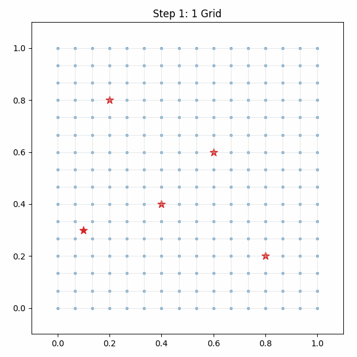

# Choromorph
**Choromorph** is a Python-based grid morphing system for visualizing deformation processes using proximity to Points of Interest (POIs) and cohesion between neighboring nodes. Inspired by physical simulations, it combines attractive and cohesive forces in a step-wise morphing process. Real-world applications include visualization of map deformations around POIs, such as urban planning, environmental changes, and geographical data analysis.

## Project Structure

```
choromorph.py                   # Morphing logic
grids.py                        # Grid construction (square/circle)
example_grids.ipynb             # Example grids and usage

images/
├── choromorph_steps.gif        # Animation of morphing process
├── choromorph_circle_grid.png  # Example of circle grid
README.md
```

---

## Example Output

### 📈 Step-by-step Morphing (GIF)


### 🖼️ Static Grid Example

---

## Parameters

- `alpha`: Attraction strength to nearest POI
- `beta`: Cohesion strength to neighbor centroid
- `max_step`: Limits movement per iteration
- `threshold`: Convergence threshold
- `max_iter`: Maximum number of iterations

---

## License

MIT License © 2025 Marco Napoleone
